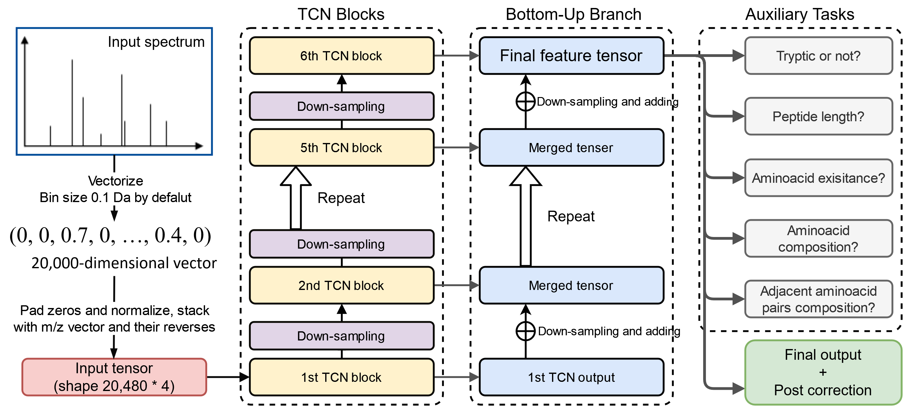

# PepNet

## Code for "Accurate __De Novo__ Peptide Sequencing Using Fully Convolutional Neural Networks"

Link to [Accurate __De Novo__ Peptide Sequencing Using Fully Convolutional Neural Networks](ttps://link.springer.com/article/10.1038/s41467-023-43010-x)

The state of the art Deep CNN neural network for *de novo* sequencing of tandem mass spectra, currently works on unmodified HCD spectra of charges 1+ to 4+.

Free for academic uses. Licensed under LGPL.

__Visit [https://denovo.predfull.com/](https://denovo.predfull.com/) to try online prediction__

## Update History

* 2023.04.27: 2nd Revised version.
* 2022.11.28: Revised version.
* 2021.12.28: First version.

## Method

Based on the structure of the residual convolutional networks. Current precision (bin size): 0.1 Th.

## How to use

__After clone this project, you should download the pre-trained model (`model.h5`) from [zenodo.org](https://zenodo.org/record/7869847) and place it into PepNet's folder.__

### Important Notes

* Will only output unmodification sequences.
* This model assumes a __FIXED__ carbamidomethyl on C
* The length of output peptides are limited to =< 30

### Required Packages

Recommend to install dependency via [Anaconda](https://www.anaconda.com/distribution/)

* Python >= 3.7
* Tensorflow >= 2.5.0
* Pandas >= 0.20
* pyteomics
* numba

Packages Required for traning:

* Tensorflow-addons

### Output format

Sample output looks like:

TITLE | DENOVO | Score | PPM Difference | Positional Score
------- | ------ | ---- | ------- | ------
spectra 1 | LALYCHQLNLCSK | 1.0000 | -3.8919184 | [1.0, 0.9999956, 1.0, 1.0, 1.0, 1.0, 0.99999976, 1.0, 1.0, 1.0, 1.0, 1.0, 1.0]
spectra 2 | HEELMLGDPCLK | 1.0000 | 4.207922 | [1.0, 1.0, 1.0, 1.0, 1.0, 1.0, 1.0, 1.0, 1.0, 1.0, 0.99999976, 1.0]
spectra  3 | AGLVGPEFHEK | 1.0000 | 0.54602236 | [1.0, 1.0, 1.0, 1.0, 1.0, 0.99999917, 1.0, 1.0, 1.0, 1.0, 1.0]

### Usage

Simply run:

`python denovo.py --input example.mgf --model model.h5 --output example_prediction.tsv`

The output file is in MGF format

* --input: the input mgf file
* --output: the output file path
* --model: the pretrained model

Typical running speed: sequencing 10,000 spectra in ~59 seconds on a NVIDIA A6000 GPU.

## Prediction Examples

We provide sample data on  for you to evaluate the sequencing performance. The `example.mgf` file contains ground truth spectra (randomly sampled from [NIST Human Synthetic Peptide Spectral Library](https://chemdata.nist.gov/dokuwiki/doku.php?id=peptidew:lib:kustersynselected20170530)), while the `example.tsv` file contains pre-run predictions.

Also, you can run `python evaluation.py --mgf example.mgf --novorst example_prediction.tsv` to generate figures presenting the de novo performance.

## Train this model

See `train.py` for sample training codes

## Related works

__Also, Visit [https://www.predfull.com/](https://www.predfull.com/) to check our previous project on full spectrum prediction__
